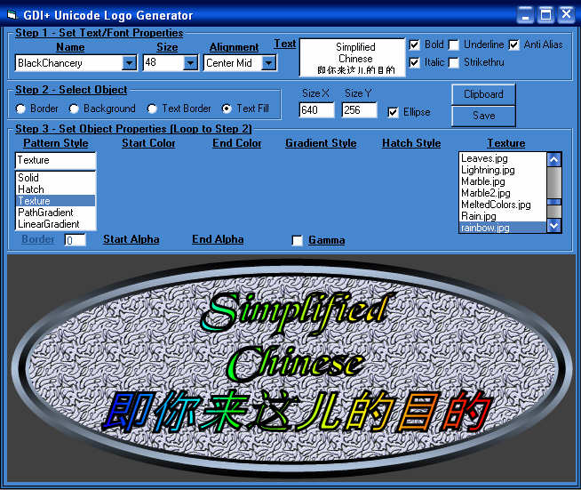



## GDI\+ TypeLib TLB \- Unicode Logo Generator

### Description

Update 07Feb, 13:46 UTC. A complete TLB TypeLibrary for GDI+ version 1.0.5 Includes all known functions, constants, enums, and structures(UDTs). Note changes in RectL/RectF - Right/Bottom are Width/Height as per Platform SDK. ALso see demo to see how strings are passed. Demo is a clone of PSC LogoMan except all the graphics are done in newer GDI+. A good example of how to use path, brush, pen, texture, hatch and gradients in GDI+. If you don't have XP or Win2k SP3 then you must install GDI+(free from Microsoft) at http://www.microsoft.com/downloads/release.asp?releaseid=32738. Requires Forms Object 2.0 which is part of Office. If you don't have Office you can download FM20.Dll as part of SetupPad.Exe at http://download.microsoft.com/download/activexcontrolpad/Install/4.0.0.950/WIN98MeXP/EN-

To see Unicode Far East glyphs in 2K/Xp you may need to go to Control Panel, Regional Configurations, Languages, and check the box for Far east support. In 98/ME you must have a Unicode font installed such as Arial Unicode MS.

Please report any errors that work with a local GDI+ Declare but not from this TLB.
 
### More Info
 

             |
---                |---
**Submitted On**   |2003-02-06 23:40:34
**By**             |[Dana Seaman\_](https://github.com/Planet-Source-Code/PSCIndex/blob/master/ByAuthor/dana-seaman.md)
**Level**          |Advanced
**User Rating**    |4.9 (217 globes from 44 users)
**Compatibility**  |VB 6\.0
**Category**       |[Graphics](https://github.com/Planet-Source-Code/PSCIndex/blob/master/ByCategory/graphics__1-46.md)
**World**          |[Visual Basic](https://github.com/Planet-Source-Code/PSCIndex/blob/master/ByWorld/visual-basic.md)
**Archive File**   |[GDI\+\_TypeL154059272003\.zip](https://github.com/Planet-Source-Code/dana-seaman-gdi-typelib-tlb-unicode-logo-generator__1-42861/archive/master.zip)

### API Declarations

Set reference to GDIplus.Tlb

